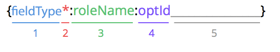

# Pandadoc Field Tags PDF example




- Use **roles** to define who needs to sign which field tag
- Use **optIds** to set variables in your document

```js
// textfield:user:name___ relates to:
"fields": {
    "name": {
        "value": "Jane",
        "role": "user"
    }
}
```

## Consult Pandadoc guides for further info

[Create a Document from File upload or URL](https://developers.pandadoc.com/docs/create-document-from-file)
